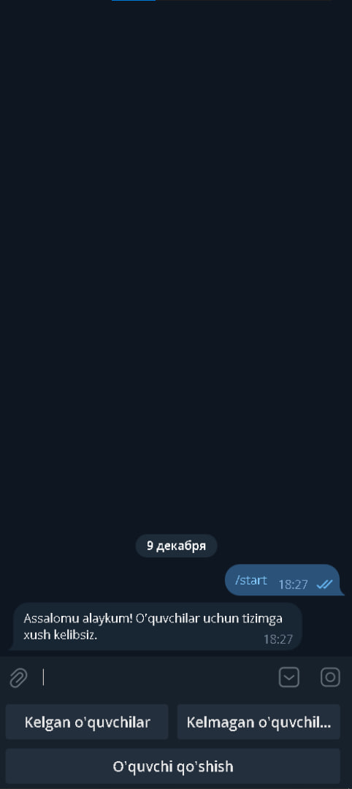

### Face-Recognition-Bot 


**Face-Recognition-Bot** - bu Telegram bot bo'lib, u o'quvchilar davomatini boshqarishda yuzni tanib olish texnologiyasidan foydalanadi. Bot o'quvchilarni yuzlari orqali aniqlaydi va ularni "Kelgan" va "Kelmagan" guruhlarga ajratadi. Bu bot aynan 10A sinfining davomatini boshqarish uchun mo'ljallangan.

---

## Xususiyatlari

- **Yuzni tanib olish**: O'quvchi telefon kamerasiga yuzini ko'rsatganda avtomatik ravishda aniqlanadi.
- **Davomat kategoriyalari**:
  - *Kelgan o'quvchilar*: Davomatga kelgan o'quvchilar ro'yxatini ko'rish.
  - *Kelmagan o'quvchilar*: Davomatga kelmagan o'quvchilar ro'yxatini ko'rish.
- **Yangi o'quvchi qo'shish**: O'quvchilarni ismi va rasmi orqali ro'yxatdan o'tkazish.
- **Foydalanuvchilar uchun qulay interfeys**: Navigatsiya uchun oson tugmalar.

---

## Katalog tuzilishi

```
Face-Recognition-Bot/
├── main.py          # Botning asosiy logikasi
├── keyboards.py     # Klaviatura va tugmalar konfiguratsiyasi
├── students/        # O'quvchilar yuz rasmlari saqlanadigan papka
└── README.md        # Loyihaning hujjatlari
```

---

## O'rnatish

1. Repozitoriyani klonlang:

   ```bash
   git clone https://github.com/yourusername/Face-Recognition-Bot.git
   cd Face-Recognition-Bot
   ```

2. Kerakli kutubxonalarni o'rnating:

   ```bash
   pip install aiogram face_recognition opencv-python
   ```

3. `main.py` fayliga botning API tokenini kiriting:

   ```python
   API_TOKEN = "<YOUR_BOT_TOKEN>"
   ```

4. `students/` papkasining mavjudligini tekshiring va rasmlarni saqlash uchun tayyorlang.

5. Botni ishga tushiring:

   ```bash
   python main.py
   ```

1. **Botni ishga tushirish**: Telegramda `/start` komandasi yuborib, botni ishga tushiring.
2. **Davomatni belgilash**: O'quvchi yuzini bot ulanadigan telefon kamerasiga ko'rsating. Bot uning kelganini qayd etadi.
3. **Davomatni ko'rish**:
   - "Kelgan o'quvchilar" tugmasidan foydalanib, kelgan o'quvchilar ro'yxatini ko'ring.
   - "Kelmagan o'quvchilar" tugmasidan foydalanib, kelmagan o'quvchilar ro'yxatini ko'ring.
4. **Yangi o'quvchi qo'shish**:
   - "Yangi o'quvchi qo'shish" tugmasidan foydalaning.
   - O'quvchining ismi va rasmini yuboring.

---

## Asosiy komponentlar

### 1. `main.py`

Ushbu fayl asosiy logikani o'z ichiga oladi:

- OpenCV va face\_recognition yordamida tasvirlarni olish va qayta ishlash.
- Telegram bot buyruqlari va xabarlarini boshqarish.

### 2. `keyboards.py`

Bu fayl Telegram bot interfeysi uchun tugmalar va menyularni belgilaydi.

### 3. `students/`

O'quvchilar rasmlari saqlanadigan papka. Har bir rasm fayli o'quvchining to'liq ismi bilan nomlanishi kerak (masalan, `John_Doe.jpg`).

---

## Ekran tasvirlari

### Asosiy menyu:




---

## Kelajakdagi yangilanishlar

- Bir nechta sinflarni qo'llab-quvvatlash.
- Batafsil davomat hisobotlari.
- Yuzni aniqlash aniqligini oshirish.
- Katta hajmdagi ma'lumotlar uchun ma'lumotlar bazasi integratsiyasi.

---


## Litsenziya

Ushbu loyiha MIT litsenziyasi ostida taqdim etiladi.

---

Loyihaga o'z hissangizni qo'shish uchun GitHub orqali muammolar yoki pull requestlar yuborishingiz mumkin!

